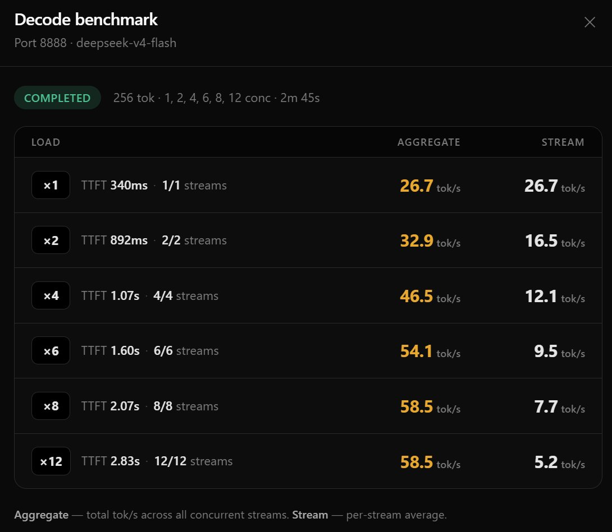

# DeepSeek-v4-Flash-One-DGX-Spark - DwarfStar 4 Engine

<p align="center">
  <a href="https://x.com/MiaAI_lab" target="_blank" rel="noopener noreferrer" style="display:inline-block;margin:0 8px;vertical-align:middle;"></a>
</p>

Thin, idempotent launcher scripts for running the **DeepSeek-V4-Flash** server built for the NVIDIA DGX Spark (GB10 / SM121) — the DwarfStar 4 (C/CUDA) engine that serves an OpenAI-compatible `/v1` API on `:8888`.

This is based on **antirez/ds4** (DwarfStar 4) and its DGX Spark fork:

- [antirez/ds4](https://github.com/antirez/ds4) — upstream DwarfStar 4 engine (MIT-licensed, C/CUDA)
- [Entrpi/ds4-on-spark](https://github.com/Entrpi/ds4-on-spark) — DGX Spark one-command install, benchmarks, and roofline analysis (what `start.sh` pulls)
- [Entrpi/ds4 (batched-serving)](https://github.com/Entrpi/ds4/tree/batched-serving) — the DGX-Spark-optimized CUDA perf fork used here

> **Note:** this repo does **not** use vLLM. `ds4-server` exposes the same `/v1` API that `vllm serve` does, but vLLM cannot read this repo's asymmetric GGUF, so the repo ships its own server.

`start.sh` calls the `ds4-serve` launcher directly rather than going through the upstream installer, for two reasons: the installer has no `--host` option (so it can only ever bind `127.0.0.1`), and it cannot select between weight sets. The upstream installer is still available behind `--install` for first-time setup.

## Requirements

- A NVIDIA DGX Spark (GB10 / SM121)
- Bash
- `curl`
- Disk space for the ~110 GiB GGUF weight set (per model)
- `ss` (for `stop.sh` and `--restart`)
- `ds4-serve` on `PATH` or at `~/.local/bin/ds4-serve` (`./start.sh --install` provides it)

## Background

**DwarfStar 4** is a small, self-contained native inference engine optimized for DeepSeek V4 Flash, written by Salvatore Sanfilippo ([antirez](https://x.com/antirez)) — deliberately narrow, not a generic GGUF runner. [Entrpi](https://github.com/Entrpi) maintains a DGX-Spark-optimized CUDA perf fork of it, plus the [ds4-on-spark](https://github.com/Entrpi/ds4-on-spark) installer this repo builds on, which serves DeepSeek-V4-Flash entirely on-device on a GB10 / SM121 DGX Spark (RTX PRO 6000 / 5090-class `sm_120` also builds).

Thanks to Bleys Goodson ([@bleysg on X](https://x.com/bleysg)).

## Quick start

```bash
./start.sh --install   # first time only: build the fork, fetch weights, install ds4-serve
./start.sh             # full DSpark stack on 0.0.0.0:8888 at 1M context
```

`--install` runs the upstream installer, which clones and builds the pinned fork, downloads the ~110 GiB GGUF set, smoke-tests, and installs `ds4-serve`. After that, plain `./start.sh` resolves the weights, prints the memory arithmetic, and launches the server directly.

## Models

Two weight sets are supported. `--list` shows which are present and where they resolved from:

```bash
./start.sh --list
./start.sh --model abliterated --restart
```

| Name | Aliases | Weights |
|---|---|---|
| `stock` | `base`, `antirez`, `iq2xxs` | `DeepSeek-V4-Flash-IQ2XXS-w2Q2K-AProjQ8-SExpQ8-OutQ8-chat-v2-imatrix-0731` |
| `abliterated` | `ablit`, `headroom128`, `hr128` | `DeepSeek-V4-Flash-0731-Abliterated-DS4-Headroom128` |

Each entry needs both its base GGUF and its matching DSpark drafter in the same directory. Weights are looked up under `$LOCAL_GGUF_DIR` first, then `$MODELS_ROOT/<subdir>` — a local copy wins because pulling 86 GiB over NFS costs about four minutes. Force one side with `--local` / `--empress`.

## Usage

```bash
PORT=8889 ./start.sh              # different port
CTX=262144 ./start.sh             # smaller context budget (KV ~= 35.6 KiB/token)
./start.sh --host 127.0.0.1       # loopback only; default binds 0.0.0.0
./start.sh --restart              # stop whatever is serving, then start
./start.sh --dry-run              # print the exact exec line and stop
./start.sh --fg                   # foreground instead of nohup
./start.sh --no-dspark            # unknown flags pass through to ds4-serve
```

Environment variables (all optional; each has a matching flag):

| Variable | Default | Meaning |
|---|---|---|
| `MODEL` | `stock` | Weight set — see [Models](#models) |
| `PORT` | `8888` | Server port |
| `HOST` | `0.0.0.0` | Bind address |
| `CTX` | `1000000` | Context budget (KV ~= 35.6 KiB/token on this box) |
| `SOURCE` | `auto` | `auto` \| `empress` \| `local` |
| `MODELS_ROOT` | `~/Empress/models` | NFS weights root |
| `LOCAL_GGUF_DIR` | `~/gguf` | Local weights directory |
| `LOG` | `~/ds4-server.log` | Server log |
| `MAX_OUT` | `32768` | Default max output tokens (`ds4-serve -n`) |
| `COALESCE_MAX` | `4` | Concurrent batch banks |
| `SERIAL_MAX_TOKENS` | `$CTX` | Deep-serial fallback cutoff; `0` = fail fast |
| `MEM_FLOOR_GB` | ds4's `4` | Memory admissions must leave free |

The last four are deliberate deviations from ds4's own defaults — see below.

## Deep-context memory governance

At `-c 1000000` this box sits at roughly 99.6% of RAM before serving a token: ~87 GiB of weights plus ~34 GiB of context. It boots anyway because the serial lane's graph is allocated **lazily**, so boot sees ~15 GiB free. That headroom then drains as the serial lane right-sizes upward on deep prompts, and it never shrinks:

```
23:16:00  ctx 1000000 -> 2561      usable 162.1 MiB
23:16:25  ctx    2561 -> 16115     usable   0.0 MiB
23:21:38  ctx   16115 -> 78924     usable   0.0 MiB  (pinned for 9h)
```

Once `usable` reaches zero the batch lane rejects every admission on the memory floor, and prompts above the deep-serial cutoff get a 503 instead of a fallback. The server wedges into a reject/503 loop that only a restart clears:

```
ds4: cont admit rejected on memory floor (bank 8: projected credits 376.0 MiB, usable 0.0 MiB ...)
ds4-server: deep-serial guard: refusing serial fallback for 68127-token prompt (max 65536)
```

Three ds4 defaults are wrong for a 1M-context box, so `start.sh` overrides them:

- **`-n 393216`** — every admission credits `prompt + max_out` tokens of KV growth and holds it for the row's lifetime, so a 68k prompt reserves 461k tokens. `MAX_OUT` caps the default; clients that send their own `max_tokens` are unaffected.
- **`DS4_SERVER_COALESCE_MAX=32`** — ds4 asks for 32 banks, the fit claws it back to ~9, and those still commit ~7 of the 15 free GiB. This box cannot serve 32 concurrent 1M streams; `4` returns ~3.8 GiB to the usable pool.
- **`DS4_SERVER_SERIAL_MAX_TOKENS=65536`** — hardcoded and does *not* scale with `-c`; it was sized for a `-c 131072` box where `ctx/2` happened to equal 65536. At 1M context that is a cliff at 6.5% of context.

Raising the serial cutoff turns a fast 503 into a slow success, and the serial lane is what drives the creep in the first place. `MAX_OUT` and `COALESCE_MAX` are what actually keep the batch lane funded; `SERIAL_MAX_TOKENS` is the safety net for when they are not. Use `--serial-max-tokens 0` to fail fast instead.

`MEM_FLOOR_GB` is deliberately left at ds4's default of 4. With ~0.5 GiB of true slack it is the only thing between this box and the OOM killer, and ds4 caches it on first read, so it cannot be retuned without a restart.

Every boot prints the resolved settings:

```
==> governor : max_out=32768 banks=4 serial_max=1000000 mem_floor=4 GiB
```

## Stopping and restarting

```bash
./stop.sh                     # stop server on :8888 (wait until port is freed)
PORT=8889 ./stop.sh           # stop server on a different port

./start.sh --restart          # stop whatever is serving, then start
```

`start.sh` is idempotent: if the server is already answering on the port, it reports the running model and exits without touching anything. Use `--restart` to switch models or change settings.

Prefer `--restart` over `pkill -x ds4-server; ./start.sh`. `ds4-server` drains in-flight requests and holds its single-instance lock well after the listening socket closes, so racing the next launch produces *"another ds4 process is already running"*. `--restart` waits on the process itself (up to 120s, then `SIGKILL`), not just the port.

Because the memory floor is a boot-time decision and the serial lane never releases what it grows, a restart is also the only way to recover a wedged server or to retune `MEM_FLOOR_GB`.

## Checking status

```bash
curl http://127.0.0.1:8888/v1/models
```

## Performance



Measured on a single NVIDIA DGX Spark (GB10 / SM121).

## Logs

Server logs go to `$LOG` (default `~/ds4-server.log`). `start.sh` waits up to 600s for the server to answer and points you there if it does not.

Lines worth watching:

| Log line | Meaning |
|---|---|
| `reduced from requested to fit memory` | The bank count was clawed back from `COALESCE_MAX` to fit free memory |
| `batch fit: free=... -> max_seq N` | How many banks the boot plan actually got |
| `cont admit rejected on memory floor` | The batch lane is out of usable memory; `usable 0.0 MiB` means wedged |
| `serial session right-sized ctx=A -> B` | The serial lane grew and will not give it back |
| `deep-serial guard: refusing serial fallback` | Prompt exceeded `SERIAL_MAX_TOKENS`; client got a 503 |

## Files

| File         | Purpose                                     |
|--------------|---------------------------------------------|
| `start.sh`   | Resolve weights, check memory, serve on `:8888` (`--install` for first-time setup) |
| `stop.sh`    | Stop the `ds4-server` process              |
| `bench.jpg`  | Decode throughput benchmark (tok/s vs context) on a single DGX Spark |
