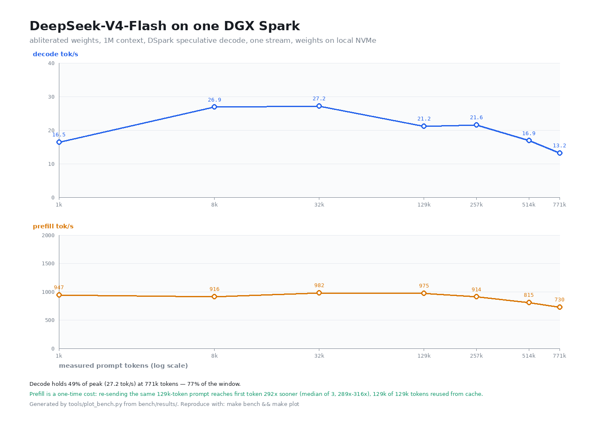

# DeepSeek-V4-Flash on one DGX Spark

<p align="center">
  <a href="https://attuneintelligence.ai" target="_blank" rel="noopener noreferrer"></a>
  <a href="https://x.com/attune_ai" target="_blank" rel="noopener noreferrer"></a>
</p>

The most intelligence we can pack onto a single NVIDIA DGX Spark: DeepSeek-V4-Flash served at a million tokens of context, filling 121 of the box's 122 gigabytes, on a native engine built for the chip rather than a general-purpose server. Thin, idempotent launcher scripts expose an OpenAI-compatible `/v1` API on `:8888`.

```bash
make bootstrap    # engine, both weight sets, drafter repair, verify
make serve        # abliterated at 1M context on 0.0.0.0:8888, speculation armed
make bench        # depth sweep, concurrency, retrieval, cache
```

This is an Attune Intelligence fork. It adds deep-context memory governance, a `stock`/`abliterated` model switch, a GGUF repair that makes the abliterated set speculate at all, and a benchmark harness that sweeps context depth rather than reporting one number. It stands on three pieces of upstream work:

- [antirez/ds4](https://github.com/antirez/ds4) — DwarfStar 4, the upstream engine (MIT, C/CUDA)
- [Entrpi/ds4-on-spark](https://github.com/Entrpi/ds4-on-spark) — the DGX Spark installer, benchmarks, and roofline analysis `start.sh` pulls
- [Entrpi/ds4 (batched-serving)](https://github.com/Entrpi/ds4/tree/batched-serving) — the DGX-Spark-optimized CUDA perf fork used here
- [MiaAI-Lab/DeepSeek-v4-Flash-One-DGX-Spark](https://github.com/MiaAI-Lab/DeepSeek-v4-Flash-One-DGX-Spark) — the launcher repo this forks

> **No vLLM.** `ds4-server` speaks the same `/v1` API as `vllm serve`, but vLLM cannot read this repo's asymmetric GGUF, so the repo ships its own server.

`start.sh` calls the `ds4-serve` launcher directly instead of the upstream installer, for two reasons: the installer has no `--host` option, so it can only ever bind `127.0.0.1`, and it cannot select between weight sets. The installer is still available behind `--install` for first-time setup.

## Requirements

- An NVIDIA DGX Spark (GB10 / SM121)
- Bash
- `curl`
- Disk space for the ~110 GiB GGUF weight set (per model)
- `ss` (for `stop.sh` and `--restart`)
- `ds4-serve` on `PATH` or at `~/.local/bin/ds4-serve` (`./start.sh --install` provides it)

## Background

**DwarfStar 4** is a small, self-contained native inference engine written by Salvatore Sanfilippo ([antirez](https://x.com/antirez)) and tuned for DeepSeek-V4-Flash: deliberately narrow, not a generic GGUF runner. [Entrpi](https://github.com/Entrpi) maintains a DGX-Spark-optimized CUDA perf fork of it, plus the [ds4-on-spark](https://github.com/Entrpi/ds4-on-spark) installer this repo builds on, which serves DeepSeek-V4-Flash entirely on-device on a GB10 / SM121 DGX Spark (RTX PRO 6000 and 5090-class `sm_120` also build).

Thanks to Bleys Goodson ([@bleysg](https://x.com/bleysg)).

## Quick start

```bash
make bootstrap        # engine + both weight sets + drafter repair + verify
make serve            # serve on 0.0.0.0:8888 at 1M context
make serve MODEL=stock  # the standard 0731 weights instead
make status           # what is running
```

`abliterated` is the default weight set — see [why we run abliterated weights](#why-we-run-abliterated-weights). `MODEL=stock` selects the standard build anywhere `MODEL` is accepted.

`make bootstrap` is idempotent and resumable. It installs `ds4-serve` if it is missing (via the upstream installer, weights skipped), downloads whatever GGUFs are not already on disk, runs the DSpark drafter repair the abliterated set needs, and verifies every drafter against the engine's schema. Re-running it after a partial download resumes rather than restarts.

Everything is still usable directly — the Makefile is a table of contents, not a wrapper layer:

```bash
./start.sh --model stock --restart
tools/fetch-weights.sh --check all
tools/gguf_dspark_remap.py --verify DRAFTER.gguf
```

`make help` lists every target.

## Models

Two weight sets are supported. `make list` shows which are present, where they resolved from, and whether their drafter is ready:

```
$ make list
MODEL          SOURCE    DRAFTER       PATH
stock          local     ready         /home/reed/gguf
abliterated    empress   ready         /home/reed/Empress/models/DeepSeek-V4-Flash-0731-Abliterated-DS4-Headroom128
```

| Name | Aliases | Weights |
|---|---|---|
| `abliterated` *(default)* | `ablit`, `headroom128`, `hr128` | `DeepSeek-V4-Flash-0731-Abliterated-DS4-Headroom128` |
| `stock` | `base`, `antirez`, `iq2xxs` | `DeepSeek-V4-Flash-IQ2XXS-w2Q2K-AProjQ8-SExpQ8-OutQ8-chat-v2-imatrix-0731` |

Each entry needs both its base GGUF and a servable DSpark drafter in the same directory. Weights are looked up under `$LOCAL_GGUF_DIR` first, then `$MODELS_ROOT/<subdir>`. A local copy wins, and it matters more than it looks: booting the abliterated set off the NAS took 9m40s of load time against roughly 1m30s from local NVMe, because the engine repacks 79 GiB of aligned artifacts at startup and every byte of that crosses the wire. `make localize MODEL=abliterated` copies a set down; `--local` / `--empress` force one side.

The weight table lives in [`tools/models.sh`](tools/models.sh) and is shared by the launcher and the fetcher, so there is exactly one place to add a model.

## Getting the weights

Each set is two files: the target GGUF and its matching DSpark drafter, both in the same directory. `make weights` fetches them and leaves them servable:

```bash
make weights MODEL=abliterated          # into $LOCAL_GGUF_DIR (default ~/gguf)
make weights MODEL=stock DEST=empress   # into $MODELS_ROOT/<subdir> instead
make weights-check                      # report what is present, download nothing
```

| Set | File | Size | Source |
|---|---|---|---|
| `stock` | `DeepSeek-V4-Flash-IQ2XXS-...-0731.gguf` | 80.76 GiB | [`antirez/deepseek-v4-gguf`](https://huggingface.co/antirez/deepseek-v4-gguf) |
| `stock` | `DSpark-drafter-Q2K-Q8-0731.gguf` | 6.49 GiB | [`bleysg/DeepSeek-V4-Flash-DSpark-drafter-GGUF`](https://huggingface.co/bleysg/DeepSeek-V4-Flash-DSpark-drafter-GGUF) |
| `abliterated` | `...-DS4-Headroom128.gguf` | 80.76 GiB | [`apetersson/...-DS4-Headroom128`](https://huggingface.co/apetersson/DeepSeek-V4-Flash-0731-Abliterated-DS4-Headroom128) |
| `abliterated` | `...-DS4-Headroom128-DSpark-support.gguf` | 5.58 GiB | same repo — **repaired before use**, see below |

Downloads go through the Hugging Face CLI (`hf`) when it is installed and fall back to resumable `curl` otherwise. Both paths are safe to re-run: a file whose size already matches the remote is skipped, a truncated one resumes. Set `HF_TOKEN` if you are pulling from a gated repo.

The abliterated variant we run is the 128 GiB-headroom build, sized for a clean 1M context on a 122 GiB box. Its FP8 parent is [`apetersson/DeepSeek-V4-Flash-0731-Abliterated-FP8`](https://huggingface.co/apetersson/DeepSeek-V4-Flash-0731-Abliterated-FP8); the refusal direction it was projected against comes from [`drowzeys/keys-DeepSeekV4-Flash-GA-0731-Dspark-Abliterated-32-32`](https://huggingface.co/drowzeys/keys-DeepSeekV4-Flash-GA-0731-Dspark-Abliterated-32-32).

## The abliterated set needs its drafter repaired

As published, the abliterated set cannot speculate. `ds4-server` aborts during load:

```
ds4: required tensor is missing: dspark.main_proj.weight
```

Its three-stage DSpark support model is exported under upstream's legacy `mtp.*` tensor names and legacy metadata keys, while ds4's DSpark loader wants `dspark.*` and `deepseek4.dspark.*`. The files are otherwise identical — 81 tensors, same shapes, same three stages distilled against target layers 40/41/42 — so this is a metadata defect, not a weights defect.

There is no useful fallback. The `mtp.*` names ds4 *does* know belong to the legacy MTP module, a different thing that expects tensors this file does not have, and `ds4-serve` refuses to pair any legacy MTP GGUF with an 0731-generation base. `--no-dspark` therefore drops straight to plain decode: roughly 3.5x fewer tokens per step.

[`tools/gguf_dspark_remap.py`](tools/gguf_dspark_remap.py) repairs it. It rewrites the header — renaming tensors, remapping the six metadata keys, deriving the `expert_count` ds4 requires from the router width — and copies the tensor payload verbatim. Thirteen tensors also need widening, because ds4 type-checks everything outside the routed-expert bank and the Headroom128 profile is more aggressive than the reference drafter (`markov_w1/w2` Q8_0 → F16, `ffn_gate_inp` and `conf_proj` Q8_0 → F32, the `hc_*_fn` family F16 → F32). Every one of those is an upcast; the tool refuses to requantize or downcast, because that would silently change the model. Cost: +72 MiB and about 15 seconds.

You do not normally invoke it. `make weights` runs it, and `start.sh` runs it on resolve if it finds a published-but-unrepaired drafter — the repaired `...-DSpark-support-ds4.gguf` lands beside the original, which is never modified.

```bash
make repair MODEL=abliterated    # rebuild it
make verify                      # check every drafter against ds4's schema
```

The proof it worked is in the log:

```
ds4: DSpark drafter loaded: ...-DSpark-support-ds4.gguf (3 layers)
ds4: CONT_MTP_ACCEPT(DSpark) D=4 steps=265 emit=988 drafts=856 hits=723 accept=84.5% tok/step=3.73
```

Full details, including the exact name and dtype maps and how the payload was validated: [`docs/dspark-drafter-repair.md`](docs/dspark-drafter-repair.md).

The FP8 parent this was converted from is [`apetersson/DeepSeek-V4-Flash-0731-Abliterated-FP8`](https://huggingface.co/apetersson/DeepSeek-V4-Flash-0731-Abliterated-FP8); the refusal direction it was projected against comes from [`drowzeys/keys-DeepSeekV4-Flash-GA-0731-Dspark-Abliterated-32-32`](https://huggingface.co/drowzeys/keys-DeepSeekV4-Flash-GA-0731-Dspark-Abliterated-32-32).

## `stock` vs `abliterated`

Both entries are the same DS4-native IQ2_XXS/Q2_K mixed-precision conversion of DeepSeek-V4-Flash-0731, and both load and serve identically. They differ in one thing: the abliterated set had a single refusal direction projected out of the FP8 parent before quantization, so it does not refuse.

- **`stock`**: the standard post-trained 0731 weights. Refuses like the released model.
- **`abliterated`**: a rank-1 abliterated derivative, refusal direction removed at attention strength λ = 3.5 across layers 10–42. Same architecture, same quant profile, same drafter; the difference is behavioral, not structural.

`Headroom128` refers to the memory budget the quant profile targets, not a capability tier. The profile spends precision where every token needs it (attention, shared experts, output head at Q8_0) and compresses the routed-expert bank hard (IQ2_XXS/Q2_K), leaving practical headroom for DS4 runtime state and KV cache on a 128 GiB host. Provenance, per-tensor profile, and integrity hashes are in the model card's `BUILD_MANIFEST.json` and `PROVENANCE.md`.

## Why we run abliterated weights

Safety fine-tuning narrows a model's reasoning, and the narrowing is measurable.

Refusal is a single linear direction in the residual stream: ablate it and the refusals go away ([Arditi et al., 2024](https://arxiv.org/abs/2406.11717)). That direction does not carry refusal alone. Safety fine-tuning entangles it with benign capacities, rotating a model's representations of mind, agency, and open-ended reasoning to sit *against* the safety direction, as though thinking freely were unsafe compliance ([Kim et al., 2026](https://arxiv.org/abs/2607.28607)). What comes out is a model that hedges, over-refuses, and flattens where it should reason.

Removing the direction restores the range and costs nothing we can measure. In the same work, ablation recovers the suppressed behavior while Theory-of-Mind and general reasoning (MMLU) stay statistically flat: competence is mechanistically independent of the refusal direction. That is the trade a research tool wants. An instrument that answers the question we hand it, without a trained-in layer of hedging in the way.

We run this behind our own access controls, and we are not claiming the model is safe or "uncensored" for general deployment. Abliteration changes behavior past refusal, and ultra-low-bit quantization can dent factuality and long-context robustness on its own. Evaluate it for your own use rather than trusting the word.

## Usage

```bash
make serve MODEL=abliterated      # restart onto a weight set
make serve PORT=8889 CTX=262144   # different port, smaller context budget
make dry-run                      # print the exact exec line and stop
make stop | make status | make logs
```

Every Makefile variable maps to a `start.sh` flag, and the script takes anything the Makefile does not:

```bash
PORT=8889 ./start.sh              # different port
CTX=262144 ./start.sh             # smaller context budget (KV ~= 35.6 KiB/token)
./start.sh --host 127.0.0.1       # loopback only; default binds 0.0.0.0
./start.sh --restart              # stop whatever is serving, then start
./start.sh --dry-run              # print the exact exec line and stop
./start.sh --fg                   # foreground instead of nohup
./start.sh --no-dspark            # unknown flags pass through to ds4-serve
```

Environment variables (all optional; each has a matching flag):

| Variable | Default | Meaning |
|---|---|---|
| `MODEL` | `abliterated` | Weight set — see [Models](#models) |
| `PORT` | `8888` | Server port |
| `HOST` | `0.0.0.0` | Bind address |
| `CTX` | `1000000` | Context budget (KV ~= 35.6 KiB/token on this box) |
| `SOURCE` | `auto` | `auto` \| `empress` \| `local` |
| `MODELS_ROOT` | `~/Empress/models` | NFS weights root |
| `LOCAL_GGUF_DIR` | `~/gguf` | Local weights directory |
| `LOG` | `~/ds4-server.log` | Server log |
| `MAX_OUT` | `32768` | Default max output tokens (`ds4-serve -n`) |
| `COALESCE_MAX` | `4` | Concurrent batch banks |
| `SERIAL_MAX_TOKENS` | ds4's `65536` | Deep-serial fallback cutoff; `0` = fail fast |
| `MEM_FLOOR_GB` | ds4's `4` | Memory admissions must leave free |
| `KV_DISK_DIR` | `~/ds4-kv` | Disk KV checkpoints; empty disables |
| `KV_DISK_MB` | `65536` | Disk budget (ds4's default when enabled is 4096) |

The last four are deliberate deviations from ds4's own defaults — see below.

## Steering at the inference layer

Your client is not the only place behaviour is decided. Three `ds4-server` defaults will surprise you if you assume llama.cpp or vLLM semantics — full detail in [`docs/inference-controls.md`](docs/inference-controls.md).

**System prompts are honoured**, and tightly enough to pin output format for machine consumers:

```bash
curl -s localhost:8888/v1/chat/completions -H 'content-type: application/json' -d '{
  "model": "ds4",
  "messages": [{"role":"system","content":"Answer with a single lowercase word."},
               {"role":"user","content":"What is the capital of France?"}]}' \
  | jq -r '.choices[0].message.content'      # paris
```

**Thinking mode is on by default**, and it is not cheap:

| request | completion tokens | `content` |
|---|---:|---|
| default | 56 | `paris` |
| `"thinking": {"type": "disabled"}` | **2** | `paris` |

Same answer, 28x the tokens. Reasoning comes back out-of-band in `message.reasoning_content`, so `content` stays clean. Turn it off with `thinking:{type:disabled}`, `think:false`, or `model=deepseek-chat`; turn it up with `reasoning_effort: low|high|max`.

**In thinking mode, client sampling knobs are ignored** — `temperature: 0` does nothing and runs are not reproducible. If you need determinism, you need non-thinking mode. For coding agents the rule of thumb is thinking *off* for tool-call and edit loops (format-bound, 28x cheaper, deterministic) and *on* for planning and debugging turns.

One trap worth knowing: thinking mode with a tight `max_tokens` truncates before the reasoning block closes, and the server then emits the unfinished deliberation as your answer (`thinking not closed, ignoring DSML in reasoning`). It looks exactly like a model quality failure. Our own retrieval benchmark scored 2/6 that way; with thinking disabled and the format pinned by a system prompt, the identical prompts score **6/6 at 128k tokens**, including a needle at 90% depth.

## Deep-context memory governance

At `-c 1000000` this box sits at roughly 99.6% of RAM before serving a token: ~87 GiB of weights plus ~34 GiB of context. It boots anyway because the serial lane's graph is allocated **lazily**, so boot sees ~15 GiB free. That headroom then drains as the serial lane right-sizes upward on deep prompts, and it never shrinks:

```
23:16:00  ctx 1000000 -> 2561      usable 162.1 MiB
23:16:25  ctx    2561 -> 16115     usable   0.0 MiB
23:21:38  ctx   16115 -> 78924     usable   0.0 MiB  (pinned for 9h)
```

Once `usable` reaches zero the batch lane rejects every admission on the memory floor, and prompts above the deep-serial cutoff get a 503 instead of a fallback. The server wedges into a reject/503 loop that only a restart clears:

```
ds4: cont admit rejected on memory floor (bank 8: projected credits 376.0 MiB, usable 0.0 MiB ...)
ds4-server: deep-serial guard: refusing serial fallback for 68127-token prompt (max 65536)
```

Three ds4 defaults are wrong for a 1M-context box, so `start.sh` overrides them:

- **`-n 393216`** — every admission credits `prompt + max_out` tokens of KV growth and holds it for the row's lifetime, so a 68k prompt reserves 461k tokens. `MAX_OUT` caps the default; clients that send their own `max_tokens` are unaffected.
- **`DS4_SERVER_COALESCE_MAX=32`** — ds4 asks for 32 banks, the fit claws it back to ~9, and those still commit ~7 of the 15 free GiB. This box cannot serve 32 concurrent 1M streams; `4` returns ~3.8 GiB to the usable pool.
- **`DS4_SERVER_SERIAL_MAX_TOKENS`** — this script used to raise it to `$CTX`. That was backwards and has been reverted: the engine's own note (`ds4_server.c:15513`) records that the serial lane at depth means "minutes of prefill, ~40x slower decode", so raising the guard turns a fast retryable 503 into an apparent hang. See [`docs/performance.md`](docs/performance.md#the-serial-lane-wedge-has-a-root-cause-and-it-is-structural).

Raising the serial cutoff turns a fast 503 into a slow success, and the serial lane is what drives the creep in the first place. `MAX_OUT` and `COALESCE_MAX` are what actually keep the batch lane funded; `SERIAL_MAX_TOKENS` is the safety net for when they are not. Use `--serial-max-tokens 0` to fail fast instead.

`MEM_FLOOR_GB` is deliberately left at ds4's default of 4. With ~0.5 GiB of true slack it is the only thing between this box and the OOM killer, and ds4 caches it on first read, so it cannot be retuned without a restart.

Every boot prints the resolved settings:

```
==> governor : max_out=32768 banks=4 serial_max=1000000 mem_floor=4 GiB
```

## Stopping and restarting

```bash
./stop.sh                     # stop server on :8888 (wait until port is freed)
PORT=8889 ./stop.sh           # stop server on a different port

./start.sh --restart          # stop whatever is serving, then start
```

`start.sh` is idempotent: if the server is already answering on the port, it reports the running model and exits without touching anything. Use `--restart` to switch models or change settings.

Prefer `--restart` over `pkill -x ds4-server; ./start.sh`. `ds4-server` drains in-flight requests and holds its single-instance lock well after the listening socket closes, so racing the next launch produces *"another ds4 process is already running"*. `--restart` waits on the process itself (up to 120s, then `SIGKILL`), not just the port.

Because the memory floor is a boot-time decision and the serial lane never releases what it grows, a restart is also the only way to recover a wedged server or to retune `MEM_FLOOR_GB`.

## Checking status

```bash
curl http://127.0.0.1:8888/v1/models
```

## Performance



Measured on a single NVIDIA DGX Spark (GB10 / SM121), abliterated weights, 1M context, DSpark speculation armed, weights on local NVMe. The figure is generated from `bench/results/` — no hand-entered numbers — and everything here is reproducible:

```bash
make bench            # depth sweep, cache, concurrency, retrieval -> bench/results/
make plot             # redraw bench.png from those results
make bench-depth      # just the curve above
```

Full method, caveats and the reasoning behind every serving default: [`docs/performance.md`](docs/performance.md).

**Decode degrades gracefully with depth — it does not fall off a cliff.** `abliterated`, 1M context, one stream:

| prompt tokens | TTFT | prefill tok/s | decode tok/s |
|---:|---:|---:|---:|
| 8,058 | 8.8 s | 916 | 26.9 |
| 32,156 | 32.8 s | 982 | **27.2** |
| 128,530 | 132 s | 975 | 21.2 |
| 257,035 | 281 s | 914 | 21.6 |
| 514,041 | 631 s | 815 | 16.9 |
| 771,048 | 1,056 s | 730 | 13.2 |

At 771k tokens — 77% of the window — decode still runs at 49% of peak while carrying 24x the context.

**Prefix caching is what makes that window practical.** The same 128k prompt sent twice, median of three runs:

| pass | served from cache | TTFT | decode tok/s |
|---|---:|---:|---:|
| cold | 0 | 134,429 ms | 26.4 |
| warm | 128,512 of 128,530 | **462 ms** | 32.6 |

**292x faster to first token** (range 289x-316x across three runs). A coding agent does not resend 300k fresh tokens per turn, it sends the same context plus a diff — so the linear prefill cost of depth is a one-time entry fee per session, not a per-turn tax. That is the argument for keeping the window at 1M rather than trading it for the ~10% of decode rate a 262k window buys back: a smaller window would not make warm turns faster, it would only evict them and charge the 134-second cold prefill again.

**Concurrency is real headroom** — 1.9x aggregate decode at 4 streams — but it costs per-stream latency, so it is throughput for a fleet rather than speed for one user.

**A server restart used to cost a deep session; now it costs about four seconds.** ds4 can checkpoint KV to disk and restore it into a bank instead of re-prefilling, but only if `--kv-disk-dir` is passed — it is off by default. `start.sh` now enables it:

| pass | served from cache | TTFT |
|---|---:|---:|
| cold, empty disk cache | 0 | 133,091 ms |
| after a **full server restart** | 128,512 of 128,530 | **2,140 ms** |

30–60x across two runs (the cold side is stable, the warm side varies), with the checkpoint load itself taking 659 ms. Verify it yourself with `make bench-restart`, which prefills deep, restarts the server, re-sends the identical prompt and records the row. Checkpoints cost ~4.6 KiB/token on disk against ~35.6 KiB/token resident. This is what makes retuning, model switching and wedge recovery affordable at 1M context. `--no-kv-disk` opts out.

**Serving from local NVMe rather than the NAS was the single largest effect measured**: boot 9m40s → 60s, and deep prefill stops stalling on demand-paged expert weights. `make localize MODEL=abliterated`.

The 20 CPU cores sitting idle are not wasted throughput: the GPU runs at 96% utilization at max boost with no power or thermal cap, CUDA graph capture is already on, and on a unified-memory part recruiting CPU cores would contend for the same LPDDR5X bus that decode is bound by. Details and the numbers behind each claim: [`docs/performance.md`](docs/performance.md).

## Logs

Server logs go to `$LOG` (default `~/ds4-server.log`). `start.sh` waits up to 600s for the server to answer and points you there if it does not.

Lines worth watching:

| Log line | Meaning |
|---|---|
| `reduced from requested to fit memory` | The bank count was clawed back from `COALESCE_MAX` to fit free memory |
| `batch fit: free=... -> max_seq N` | How many banks the boot plan actually got |
| `cont admit rejected on memory floor` | The batch lane is out of usable memory; `usable 0.0 MiB` means wedged |
| `serial session right-sized ctx=A -> B` | The serial lane grew and will not give it back |
| `deep-serial guard: refusing serial fallback` | Prompt exceeded `SERIAL_MAX_TOKENS`; client got a 503 |

## Files

| Path | Purpose |
|---|---|
| `Makefile` | Every workflow in the repo: bootstrap, weights, serve, bench, verify |
| `start.sh` | Resolve weights, repair the drafter if needed, check memory, serve on `:8888` |
| `stop.sh` | Stop the `ds4-server` process |
| `tools/models.sh` | The weight table and the source/local resolver, shared by the scripts |
| `tools/fetch-weights.sh` | Download a weight set and leave it servable |
| `tools/gguf_dspark_remap.py` | Repair a legacy `mtp.*` DSpark drafter into ds4's `dspark.*` layout |
| `tools/bench.py` | Benchmark harness: depth, concurrency, retrieval, cache, restart |
| `tools/kv-status.sh` | Disk KV tier: usage, budget pressure, restores, admissions |
| `docs/dspark-drafter-repair.md` | Why the abliterated drafter needs repairing, and exactly what changes |
| `tools/plot_bench.py` | Render `bench.png` from the recorded results |
| `docs/performance.md` | Every serving default, justified with measurements |
| `docs/inference-controls.md` | System prompts, thinking mode, and what ds4 ignores |
| `bench/results/` | Recorded runs, one JSONL row per measurement |
| `bench.png` | Generated by `make plot` from `bench/results/` |

Adding a model means one line in `tools/models.sh`; the launcher, the fetcher and the repair all read from that table.
